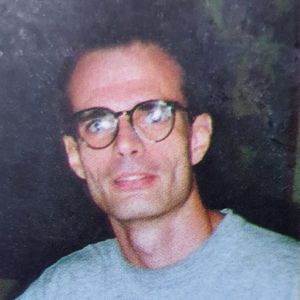
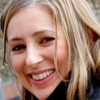
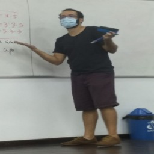
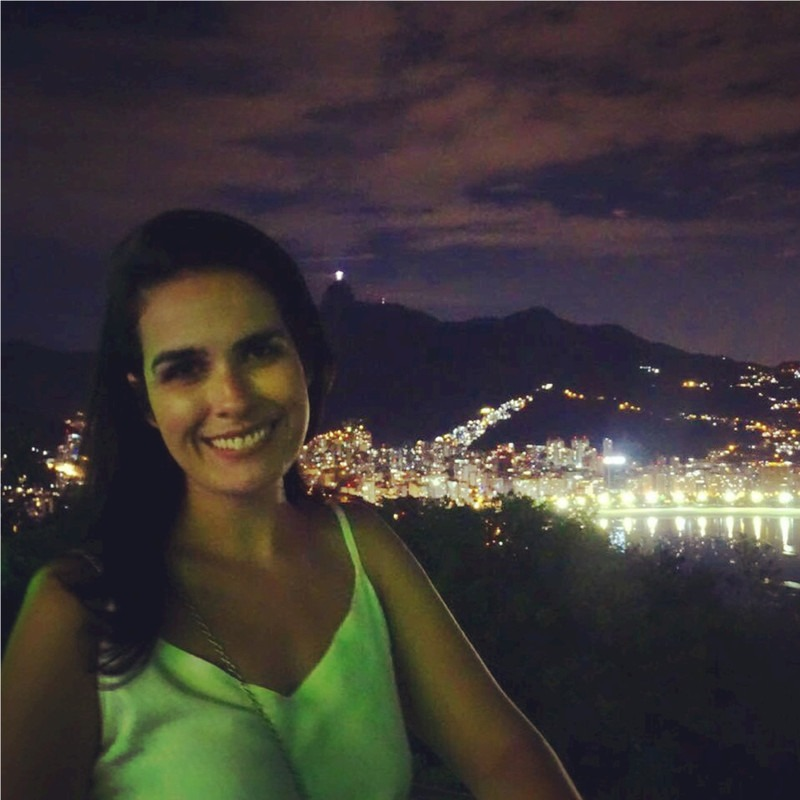
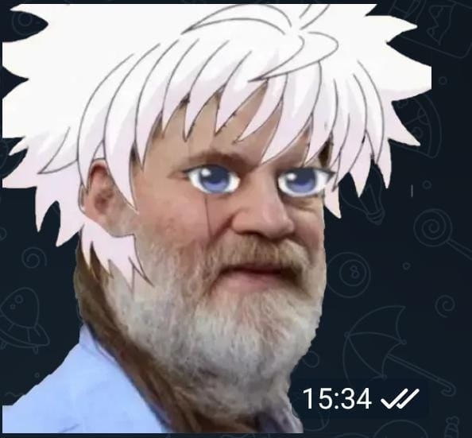
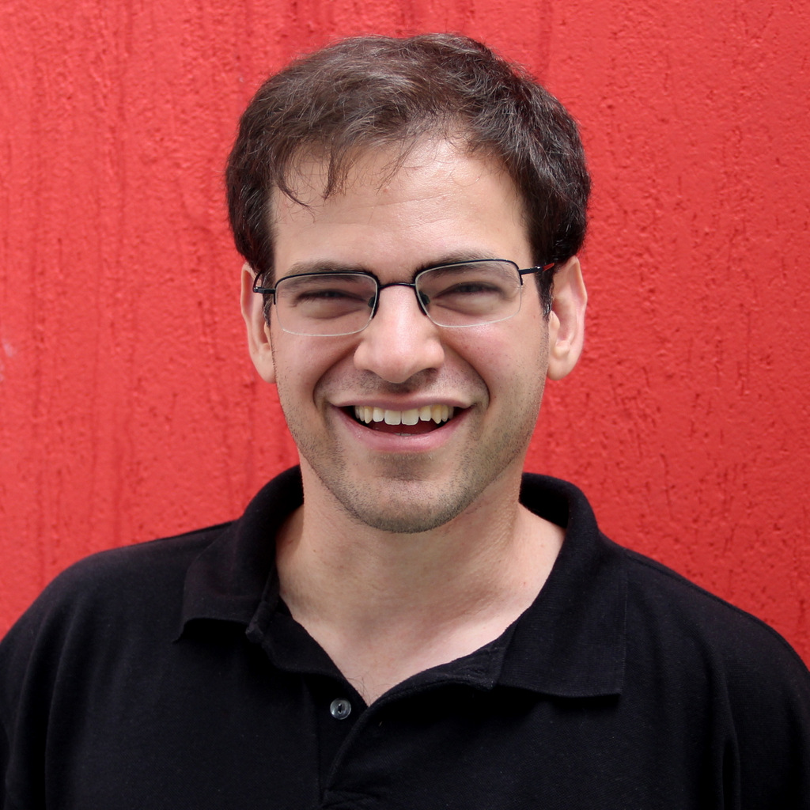

---
#
# By default, content added below the "---" mark will appear in the home page
# between the top bar and the list of recent posts.
# To change the home page layout, edit the _layouts/home.html file.
# See: https://jekyllrb.com/docs/themes/#overriding-theme-defaults
#
layout: page
---

    

## Ciência da Computação
O Curso de Ciência da Computação da UFRJ teve seu início em 1974,sendo um dos primeiros cursos de Computação no Brasil. O objetivo do curso consite em formar profissionais na área de Computação e Informática, com sólidos fundamentos em Ciência da Computação vistas ao mercado profissional, tanto nas áreas teóricas e de aplicação de computadores, como no projeto e desenvolvimento de equipamentos e software básico, utilizando modernas tecnologias de Engenharia de Software

## CORPO DOCENTE
#### Primeiro Período

Fotinha               | Nome               | Matéria               | Site| E-mail 
--------------------- | --------------------- | --------------------- | ---------------------| ---------------------
| Valéria Menezes Bastos| Prog. de Computadores 1|[http://dcc.ufrj.br/~valeriab](http://dcc.ufrj.br/~valeriab)|valeria@ic.ufrj.br|
{: width ="250"}|Severino Collier Coutinho|Introd Pensamento Dedutivo|[http://dcc.ufrj.br/~collier](http://dcc.ufrj.br/~collier)|collier@ic.ufrj.br|
|Carla Amor Divino Moreira Delgado| Projeto de Carreira|[http://dcc.ufrj.br/~carla](http://dcc.ufrj.br/~carla)|carla@ic.ufrj.br|
|Hugo de Holanda Cunha Nobrega|Num. Inteiros e Cripto.|[https://hugonobrega.com](https://hugonobrega.com)|hugonobrega@ic.ufrj.br|
|Juliana Baptista dos Santos França|Processo de Software||julianabsf@ic.ufrj.br|
|Nelson Quilula Vasconcelos|Fundamentos da Computação|[http://dcc.ufrj.br/~lula/FCD](http://dcc.ufrj.br/~lula/FCD)|lula@im  .ufrj.br|
|Daniel Sadoc Menasché|Fundamentos da Computação|[http://dcc.ufrj.br/~sadoc](http://dcc.ufrj.br/~sadoc)|sadoc@ic.ufrj.br|

## MATÉRIAS

Ao entrarem no curso de Ciência da Computação, todos os calouros são automaticamente inscritos em 6 disciplinas. Na maioria delas, os calouros não se misturam com alunos de períodos mais avançados ou de outros cursos, formando uma turma só de calouros de Ciência da Computação. Essas matérias são bem importantes, pois (com exceção de Introdução ao Pensamento Dedutivo) todas elas são pré-requisitos para cursar matérias do 2° período e possivelmente outras mais à frente. Aqui serão apresentadas brevemente cada disciplina do 1° período.

#### <b>Programação de Computadores 1</b>
 - Resolução de problemas de forma algorítmica

 - Funções e modularização

 - Recursão

 - Variáveis, expressões

 - Controle de fluxo e repetições

 - Tipos básicos e estruturados

 - Tipos abstratos de dados

 - Vetores e matrizes

 - Cadeias de caracteres

 - Documentação, legibilidade, manutenção e eficiência de programas.

Essa matéria vai ser a primeira interação do aluno com a programação dentro do curso. Aqui você aprenderá diversos fundamentos da linguagem C, que poderão ser aprofundados a partir do 2° período na disciplina Programação de Computadores II. Os conhecimentos adquiridos nessa linguagem serão úteis como uma base para aprender outras linguagens que surgiram depois do C, como o Java, visto na disciplina Programação Orientada a Objeto.

#### <b>Introdução ao Pensamento Dedutivo</b>
 - Conjuntos e suas operações

 - Conceitos básicos de lógica

 - Definição, teorema e demonstração

 - Medidas de comprimento e área

 - Teorema de Pitágoras e áreas

 - Congruência e semelhança de triângulos

 - Aplicações de geometria plana

 - Irracionalidade de √2 e números reais

 - Coordenadas no plano

 - Função, domínio e imagem

 - Circunferência

 - Trigonometria

 - Funções linear e quadrática

 - Gráficos de funções

 - Funções polinomiais

 - Raízes e divisão de polinômios

 - Exponencial e logaritmo.

Essa matéria é uma introdução à matemática de “adultos”, sendo basicamente o pré-Cálculo de Ciência da Computação. Sendo assim, essa matéria vai mudar a forma como você entende certos conceitos matemáticos e, principalmente, como você enfrenta um problema. Em vez de decorar fórmulas, você utilizará teoremas para fundamentar uma possível solução e a solução de um problema pode servir como base para solucionar outros.

#### <b>Números Inteiros e Criptografia</b>
 - Divisão de inteiros e algoritmo euclidiano

 - Primos e o teorema da fatoração única

 - Indução e recursão

 - Aritmética modular e teorema de Fermat

 - Testes de primalidade

 - Criptografia RSA.

Se você leu “Criptografia” no nome da matéria e achou que iria virar um “mestre dos códigos”, talvez fique um pouco desapontado. No entanto, essa matéria é de extrema importância para os períodos seguintes e essencialmente introduz a matemática utilizada por cientistas da computação.

Grande parte do tempo do curso será utilizado provando propriedades dos números inteiros, em especial, os números primos. O objetivo final disso é abordar o funcionamento do sistema de criptografia RSA, amplamente utilizado ao redor do mundo e visto no fim da disciplina. Enquanto o professor for o Hugo, recomenda-se que o aluno esteja preparado para as suas listas de exercício “do demônio”, que são bem trabalhosas, mas servem como um bom preparo para as provas.

#### <b>Fundamentos da Computação</b>

 - Organização dos sistemas de computação unitários e distribuídos

 - Inicialização e finalização do sistema de computação

 - Caminho percorrido por um programa

 - Representação, processamento e armazenamento digital de dados (sistemas de numeração, representação de caracteres, áudio e imagem, álgebra booleana, circuitos lógicos, representação e aritmética de números inteiros e reais)

 - Codificação, envio, transmissão e recepção de dados digitais em redes de computadores.

Essa é uma matéria bem teórica, na qual você aprenderá sobre o funcionamento interno do seu computador. Entre outras informações, será apresentado ao aluno como o computador interpreta e armazena os diversos tipos de dados e como funciona uma rede de computadores

#### <b>Processo de Software</b>

 - Conceitos de organização, sistema e sistema de informação

 - Processos de Negócio (Modelagem de Processos (BPMN))

 - Introdução a Engenharia de Software (Conceito de Partes Interessadas, Valor e Qualidade de Software)

 - Processo de Software (Requisitos, Modelagem, Projeto de software, Implementação, Testes, Manutenção)

 - Conceitos de no-code programming.

Nessa disciplina, você se tornará um Engenheiro de Software. Além das aulas teóricas que vão tratar dos vários modelos de desenvolvimento de um sistema, haverá projetos nos quais é esperado que o aluno passe por diversas etapas do desenvolvimento, como análise de viabilidade, levantamento de requisitos e prototipação de um sistema.

#### <b>Projeto de Carreira</b>
 - Identidade Profissional: Relações entre formação e carreira profissional

 - Perfis profissionais na área de computação e identidade profissional

 - Plano de carreira

 - Comunicação profissional: comunicação e contexto-leitura, compreensão e escrita de textos técnicos/acadêmicos

 - Autorregulação da Aprendizagem: Projetos de aprendizagem

 - Aprendizagem universitária

 - Gestão de tempo

 - Cidadania e dimensões do trabalho: o trabalho e a sociedade

 - Ética, sociedade e trabalho

 - Legislação-aspectos individuais.

Você esperava ter que planejar todo o seu trajeto ao longo do curso de Ciência da Computação e até o seu futuro após a formatura já no primeiro período? Não? Pois é exatamente disso que trata a disciplina Projeto de Carreira.

Através de questionários, atividades de pesquisa e palestras de profissionais da área de computação; o aluno será exposto às várias possibilidades de carreira na área de computação e terá uma ideia melhor do que é seu “futuro ideal”. Isso ajudará você a tomar decisões dentro da faculdade, como qual disciplina eletiva escolher por exemplo.

## PROJETO PEDAGÓGICO
Com uma grade curricular contemporânea e um corpo docente formado, em sua maioria, por professores e doutores com ampla experiência, o Curso de Ciência da Computação da UFRJ coloca o aluno como protagonista do processo de aprendizagem, capacitando-o para ter a autonomia necessária  para atender domínios diversificados de aplicação da computação, assim como as distintas vocações institucionais onde profissionais da Ciência da Computação venham a atuar.
O Projeto Pedagógico inclui uma gama de competências e conhecimentos profissionais que podem ser agrupados dentro dos seguintes perfis:

 - Ciência de Dados
 - Computação Científica.
 - Engenharia de Dados:
 - Engenharia de Software
 - Sistemas Computacionais e Comunicação:
 - Teoria da Computação:

Os perfis supracitados são os diferentes caminhos que o aluno do curso de Ciência da Computação pode seguir ao longo da sua trajetória na UFRJ (por meio das disciplinas de Escolha Condicionada),  o que demonstra a flexibilidade do curso.

#### <b>ESTRUTURA CURRICULAR</b>

#### <b>Disciplinas Obrigatórias</b>

O Curso conta com um total de 35 disciplinas obrigatórias. Segue abaixo o esquema da grade curricular com as disciplinas obrigatórias:

#### <b>Disciplinas de Escolha Condicionada</b>
São disciplinas do curso de Ciência da Computação cursadas pelo aluno conforme escolha do mesmo.

#### <b>Disciplinas de Escolha Restrita</b>
Para atender às legislações vigentes acerca de temas transversais, foram incluídas disciplinas eletivas de vários institutos.

#### <b>Disciplinas de Livre Escolha</b>
O aluno do Curso de Ciência da Computação pode fazer até duas disciplinas de qualquer curso da UFRJ através das Disciplinas de Livre Escolha.

#### <b>Trabalho de Conclusão do Curso</b>
Como o Curso de Ciência da Computação busca formar um indivíduo crítico, competente, inovador, criativo e transformador, o desenvolvimento do TCC é fundamental para consolidar os conhecimentos adquiridos durante seus longos anos na UFRJ. Para suporte à realização do TCC, são previstas duas disciplinas (Metodologia de Pesquisa e Trabalho de Conclusão de Curso) para auxiliar na realização do TCC, situadas nos dois últimos períodos da grade curricular.

#### <b>Atividades Complementares</b>
As atividades Complementares são muito importantes no desenvolvimento de habilidades acadêmicas, científicas e culturais, pois contribuam para a formação do aluno, em seus aspectos técnicos, científicos e profissionais.
Alguns exemplos de atividades complementares são:

 - Palestras.
 - Projetos de pesquisa.
 - Congressos.
 - Seminários.
 - Cursos livres.
 - Estágio
 - Monitorias

[Aqui](https://dcc.ufrj.br/ensino/graduacao/normas-de-atividades-complementares-2) você pode achar todas as atividades complementares

## Coordenação

## LOCAIS

#### <b>RU'S</b>
<b>Objetivo</b>: Oferecer alimentação de qualidade, equilibrada, e acessível de forma a favorecer a permanência dos estudantes no espaço universitário, permitindo-lhes dedicação integral aos estudos, sendo importante meio de combate à evasão escolar.

<b>Unidades</b>: O Sistema é composto por um Restaurante Universitário (RU) Central e outros dois RUs satélites localizados no prédio da Faculdade de Letras e no do Centro de Tecnologia (CT), todos no Campus da Cidade Universitária, na Ilha do Fundão.

Nós, da Ciência da Computação, nos localizamos mais perto do Restaurante Universitário do CT, logo esse é o RU mais frequentado.

RU               | Segunda à Sexta                | Finais de Semana e Feriados                  | Preço
--------------------- | --------------------- -----------| --------------------- | ---------------------
RU CENTRAL            | Almoco: 11h às 14:15   Jantar 17:30 às 20:15 | Almoco: 12h às 14h   Jantar 17:30 às 19:15 | R$ 2,00
RU CT                 | Almoco: 10:30 às 14:30   Jantar 17:30 às 20:15 | Somente no RU Central | R$ 2,00
RU LETRAS             | Almoco: 11h às 14:15   Jantar 17:30 às 20:15 | Somente no RU Central | R$ 2,00

#### <b>BIBLIOTECA DO NCE</b>
A biblioteca principal para os alunos de Computação encontra-se no NCE. Lá podem-se encontrar livros sobre todas as materias e além. O ambiente é muito agradável.

<b>Biblioteca do Núcleo de Computação Eletrônica - NCE </b>
 
 - Responsável: Raquel de Melo Porto
 - Telefone: (21) 3938-3223
 - E-mail: biblioteca@nce.ufrj.br / raquel@nce.ufrj.br
 - Site: [http://portal.nce.ufrj.br/index.php/servicos/biblioteca](http://portal.nce.ufrj.br/index.php/servicos/biblioteca)
 - Endereço: ​Av. Athos da Silveira Ramos, 274 Prédio do CCMN - Bloco C  - Cidade Universitária - Ilha do Fundão - Rio de Janeiro - RJ
 - Atendimento: Segunda à sexta-feira de 9h às 17h

Siga também o NCE no [Instagram!](instagram.com/nceufrj/)

## CENTRO ACADÊMICO

O CAInfo é uma entidade estudantil que representa o curso de Ciência da Computação da UFRJ.

O CAInfo possui uma sala no CCMN, lá você pode usar geladeira, microondas;
Eles possuem também alguns jogos como: ping-pong, videogames e jogos de tabuleiro;

Das funções do CAInfo, estão:

- Representação dos estudantes nas congregações do Instituto de Matemática (IM), nas reuniões entre CA's, nas reuniões do Diretório Central dos Estudantes (DCE) e do Dpto de C. da Computação (DCC);
- Organização de eventos de confraternização e integração dos alunos, como a recepção dos calouros, festas, campeonatos esportivos, eventos culturais e etc.;
- Gerenciamento de uma avaliação semestral dos professores, de uma lista de discussão on-line, de um repositório de provas antigas e deste site;
- Administrar o dinheiro arrecadado e zelar pela conservação das salas de aulas, laboratórios e equipamentos. 

